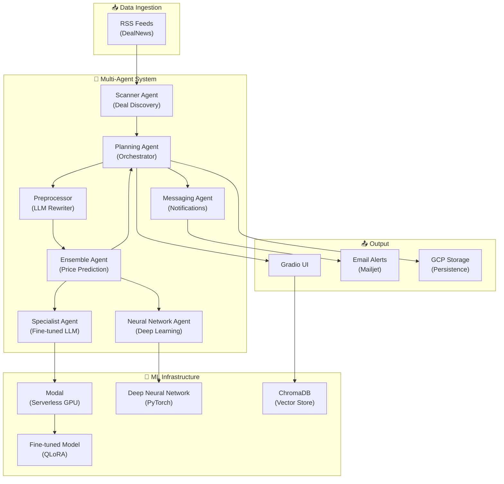

# 💰 The Price is Right

[](https://huggingface.co/spaces/kaushikpaul/Price-Is-Right)
[](https://huggingface.co/kaushikpaul/price-2026-01-25_17.05.35-lite)
[](https://huggingface.co/datasets/kaushikpaul/items_prompts_lite)
[](https://www.python.org/)

An **Autonomous Multi-Agent AI System** that discovers exceptional deals by combining **fine-tuned Large Language Models**, **Deep Neural Networks**, and **RAG-powered analysis**. The system scrapes live deal feeds, predicts true product values using ensemble ML models, and instantly alerts you when it finds items priced significantly below their estimated worth.

> **Try it live**: [https://huggingface.co/spaces/kaushikpaul/Price-Is-Right](https://huggingface.co/spaces/kaushikpaul/Price-Is-Right)

---

## ✨ Key Features

- **🤖 Multi-Agent Architecture** — Coordinated system of 6 specialized AI agents working in harmony
- **🧠 Fine-tuned LLM** — Custom-trained language model for accurate product price prediction
- **📊 Ensemble ML Pipeline** — Combines fine-tuned LLM with deep neural networks for robust estimates
- **📈 Real-time Deal Discovery** — Automated RSS feed scraping with intelligent deal extraction
- **🔮 RAG-Powered Analysis** — Vector embeddings with ChromaDB for semantic product understanding  
- **📧 Instant Notifications** — Email alerts when exceptional deals (>$50 discount) are discovered
- **📉 3D Visualization** — t-SNE dimensionality reduction for interactive deal embedding visualization
- **🎨 Modern Gradio UI** — Sleek dark-themed interface with glassmorphism design

---

## 🏗️ Architecture Overview



### Agent Responsibilities

| Agent | Role | Technologies |
|-------|------|--------------|
| **Planning Agent** | Orchestrates the entire pipeline, coordinates agents, and identifies the best deals | Agent coordination, threshold filtering |
| **Scanner Agent** | Scrapes RSS feeds, extracts deals, and uses GPT to select high-quality items | OpenRouter API, Structured Outputs, feedparser |
| **Preprocessor** | Rewrites product descriptions into standardized format for ML models | LiteLLM, GPT-based text normalization |
| **Ensemble Agent** | Combines predictions from multiple models using weighted averaging | Ensemble learning (90% NN + 10% LLM) |
| **Specialist Agent** | Runs fine-tuned LLM on serverless GPU infrastructure | Modal, PEFT/QLoRA, Transformers |
| **Neural Network Agent** | Performs inference using deep neural network | PyTorch, HashingVectorizer |
| **Messaging Agent** | Composes and sends deal alert emails | Mailjet API, LiteLLM |

---

## 🧠 Machine Learning Pipeline

### 1. Custom Fine-tuned LLM

The heart of the price prediction system is a **fine-tuned language model** trained specifically for product price estimation:

- **Base Model**: Lightweight foundation model optimized for inference
- **Training Technique**: **QLoRA (Quantized Low-Rank Adaptation)** for parameter-efficient fine-tuning
- **Dataset**: [22,000 curated product-price pairs](https://huggingface.co/datasets/kaushikpaul/items_prompts_lite)
- **Deployment**: Serverless GPU inference via **Modal** for cost-effective scaling
- **Model Hub**: [kaushikpaul/price-2026-01-25_17.05.35-lite](https://huggingface.co/kaushikpaul/price-2026-01-25_17.05.35-lite)

### 2. Deep Neural Network

A **10-layer deep neural network** with modern architecture for robust price prediction:

```python
Architecture:
├── Input Layer (5000 features via HashingVectorizer)
├── 8x Residual Blocks with:
│   ├── Linear + LayerNorm + ReLU + Dropout
│   └── Skip Connections for gradient flow
└── Output Layer (1 neuron for price regression)
```

**Key Features**:

- **Residual/Skip Connections** — Enables training of deep networks without vanishing gradients
- **Layer Normalization** — Stabilizes training across varying input distributions
- **Dropout Regularization** — Prevents overfitting on training data
- **Log-space Predictions** — Models price distributions more effectively

### 3. Ensemble Prediction

The final price estimate combines both models:

```
Final Price = 0.9 × Neural Network + 0.1 × Fine-tuned LLM
```

This weighted ensemble leverages the strengths of both approaches:

- **Neural Network**: Fast, deterministic, handles edge cases well
- **Fine-tuned LLM**: Semantic understanding, contextual price reasoning

---

## 🔧 Tech Stack

| Category | Technologies |
|----------|-------------|
| **AI/ML** | PyTorch, Transformers, PEFT, QLoRA, scikit-learn |
| **LLM Providers** | OpenRouter, LiteLLM (model-agnostic routing) |
| **Vector Database** | ChromaDB (embeddings + similarity search) |
| **Serverless ML** | Modal (GPU inference platform) |
| **Data Processing** | BeautifulSoup, feedparser, Pydantic |
| **Visualization** | Plotly, t-SNE (dimensionality reduction) |
| **UI Framework** | Gradio 6.5 with custom CSS theming |
| **Cloud Storage** | Google Cloud Storage (state persistence) |
| **Notifications** | Mailjet API (transactional emails) |
| **Hosting** | Hugging Face Spaces |

---

## 📁 Project Structure

```
Price-Is-Right/
├── main/
│   ├── agents/
│   │   ├── agent.py              # Base agent class with logging
│   │   ├── planning_agent.py     # Orchestrator agent
│   │   ├── scanner_agent.py      # RSS scraping + GPT selection
│   │   ├── ensemble_agent.py     # Model ensemble coordinator
│   │   ├── specialist_agent.py   # Fine-tuned LLM on Modal
│   │   ├── neural_network_agent.py # PyTorch model wrapper
│   │   ├── deep_neural_network.py  # DNN architecture definition
│   │   ├── preprocessor.py       # LLM-based text normalization
│   │   ├── messaging_agent.py    # Email notification handler
│   │   └── deals.py              # Pydantic models for deals
│   ├── ui/
│   │   ├── gradio_ui.py          # Main Gradio interface
│   │   ├── styles.py             # Custom CSS theming
│   │   └── helpers.py            # UI utility functions
│   ├── database/
│   │   └── memory.json           # Local deal persistence
│   ├── products_vectorstore/     # ChromaDB vector storage
│   ├── deal_agent_framework.py   # Main framework orchestrator
│   ├── rate_limiter.py           # GCP-backed request limiting
│   ├── app.py                    # Application entry point
│   └── log_utils.py              # Logging configuration
├── pyproject.toml                # Project dependencies
├── requirements.txt              # Pip dependencies
└── README.md
```

---

## 🚀 Quick Start

### Prerequisites

- Python 3.12+
- [uv](https://github.com/astral-sh/uv) (recommended) or pip

### Installation

```bash
# Clone the repository
git clone https://github.com/Kaushik-Paul/Price-Is-Right.git
cd Price-Is-Right

# Install dependencies using uv (recommended)
uv sync

# Or using pip
pip install -r requirements.txt
```

### Configuration

Create a `.env` file in the project root:

```env
# Required - LLM API Access
OPENROUTER_API_KEY=sk-or-...

# Required - Modal (for fine-tuned model)
MODAL_TOKEN_ID=...
MODAL_TOKEN_SECRET=...

# Optional - Email Notifications
MAILJET_API_KEY=...
MAILJET_API_SECRET=...
MAILJET_FROM_EMAIL=your-email@domain.com
MAILJET_TO_EMAIL=recipient@domain.com

# Optional - Cloud Storage (for Hugging Face Spaces)
USE_GCP=true
GCP_BUCKET_NAME=your-bucket-name
GCP_SERVICE_ACCOUNT_BASE64=...

# Optional - Rate Limiting
MAX_DAILY_RUNS=20
```

### Running Locally

```bash
# Navigate to main directory
cd main

# Run the application
python app.py
```

The Gradio interface will launch at `http://localhost:7860`.

---

## 🛠️ Data Infrastructure Setup

### Vector Database Setup

The project uses a **ChromaDB** vector store to enable semantic product discovery. You must populate this store before the 3D visualization and scanner agent can function optimally.

```bash
# Navigate to the main directory
cd main

# Run the build script to download data and generate embeddings
python build_vector_store.py
```

**What this script does:**

1. Downloads the [22,000 item dataset](https://huggingface.co/datasets/kaushikpaul/items_prompts_lite) using the `datasets` library.
2. Initializes a persistent ChromaDB instance in `main/products_vectorstore`.
3. Generates embeddings for product descriptions and stores them with category metadata.
4. Enables the **3D Embedding Visualization** in the Gradio UI.

---

## 🎯 How It Works

1. **Deal Discovery**: Scanner Agent fetches latest deals from electronics/tech RSS feeds
2. **Smart Filtering**: GPT analyzes raw deals and selects the 5 most promising with clear prices
3. **Text Preprocessing**: LLM rewrites product descriptions into standardized format
4. **Price Prediction**: Ensemble of fine-tuned LLM + neural network estimates true value
5. **Opportunity Detection**: System flags items priced >$50 below estimated value
6. **Instant Alerts**: Messaging Agent sends email notification for exceptional deals
7. **Persistence**: Deals are stored in GCP (cloud) or local JSON for history tracking

---

## 📊 Data & Model Training

### Dataset

The [items_prompts_lite](https://huggingface.co/datasets/kaushikpaul/items_prompts_lite) dataset contains:

- **22,000 product-price pairs** across 8 categories
- Categories: Appliances, Automotive, Cell Phones, Electronics, Musical Instruments, Office Products, Tools, Toys & Games
- Curated from Amazon product listings with verified prices

### Model Training

The fine-tuned model was trained using:

- **Supervised Fine-Tuning (SFT)** on product description → price task
- **QLoRA optimization** for memory-efficient training
- **Deployed on Modal** for serverless GPU inference

---

## 🖥️ UI Features

| Feature | Description |
|---------|-------------|
| **Email Input** | Enter your email to receive instant deal alerts |
| **Hunt for Deals** | One-click button to trigger the full agent pipeline |
| **Rate Limiting** | 20 runs per day limit (resets at 12 AM IST) |
| **Deal Table** | Sortable table with price, estimate, discount, and links |
| **Live Logs** | Real-time agent activity logs with color-coded output |
| **3D Visualization** | Interactive t-SNE plot of product embeddings |

---

## 🔒 Production Features

- **Rate Limiting**: GCP-backed daily limit tracking with IST timezone reset
- **Memory Safety**: Prevents data loss with successful-load verification
- **Error Handling**: Graceful degradation when external services fail
- **Scalable Infrastructure**: Serverless model deployment on Modal
- **Cloud Persistence**: GCP Storage integration for stateless hosting

---

## 📄 License

This project is licensed under the MIT License — see the [LICENSE](LICENSE) file for details.

---

## 🙏 Acknowledgments

- [Hugging Face](https://huggingface.co/) for model hosting and Spaces deployment
- [Modal](https://modal.com/) for serverless GPU infrastructure
- [OpenRouter](https://openrouter.ai/) for unified LLM API access
- [DealNews](https://www.dealnews.com/) for real-time deal feeds

---

<p align="center">
  <strong>Built with ❤️ using cutting-edge AI/ML technologies</strong>
</p>
